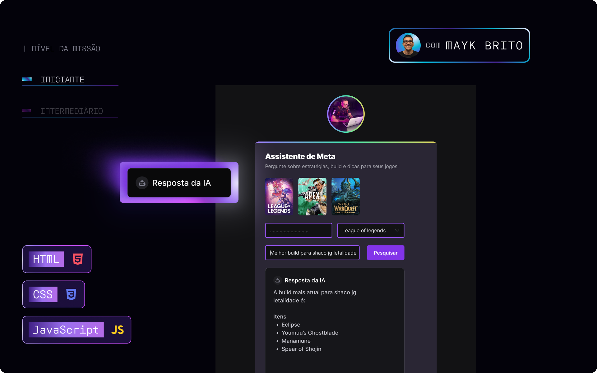

<h1 align="center">🎮 Esports | Assistente de IA para Gamers</h1>

<p align="center">
  Projeto desenvolvido durante o evento <strong>NLW Agents Iniciante - Full-Stack da Rocketseat</strong>, utilizando <strong>HTML</strong>, <strong>CSS</strong>, <strong>JavaScript</strong> e integração com a <strong>API Gemini</strong> do Google.
</p>

<p align="center">
  
</p>

---

## 🛠️ Tecnologias Utilizadas

- HTML5
- CSS3
- JavaScript 
- API Gemini 
---

## 💡 Aprendizados

Neste projeto, desenvolvi um assistente inteligente voltado para gamers, que utiliza inteligência artificial para responder perguntas, dar dicas de jogos e melhorar a experiência do usuário. Aprendi a trabalhar com APIs de IA, manipulação de DOM e aprimorei o uso de HTML, CSS e JavaScript em um contexto real.

---

## 🚀 Como Executar

1. Clone o repositório:
   ```bash
   git clone https://github.com/felipekenjii/nlw-agents-esports.git
